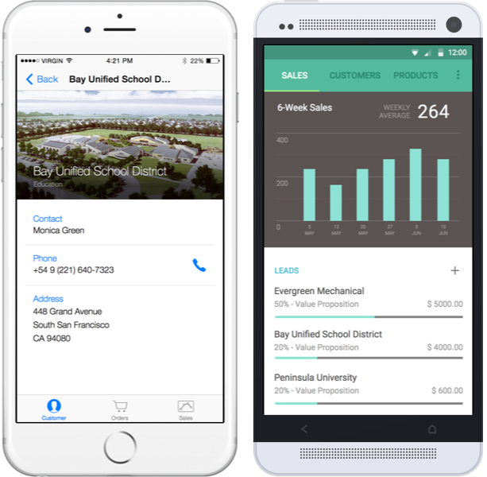

#Xamarin CRM

Xamarin CRM is a demo app whose imagined purpose is to serve the mobile workforce of a fictitious company that sells 3D printer hardware and supplies. The app empowers salespeople to track their sales performance, manage leads, view their contacts, manage orders, and browse the product catalog.

####Supported platforms: iOS and Android

####The app architecture consists of two parts:
  1. A Xamarin.Forms mobile app for iOS and Android.
  2. A .NET Web API-backed Entity Framework based Azure Mobile Service for data.

**The Azure Mobile Service does not need to be deployed by you.** There is already an instance of the service up and running in Azure, and the mobile app is configured by default to consume that service instance. We've included the code for the service so that you may run your own service instance on Azure if you'd like.

##Xamarin.Forms app (Xamarin CRM)

####[Setup Instructions](https://github.com/xamarin/app-crm/wiki/Setup-Xamarin-CRM-app)

####[Install the app NOW without building from source code (coming soon)](https://github.com/xamarin/app-crm/wiki/Install-the-app-NOW-without-building-from-source-code)

####Featured technologies
* [Xamarin.Forms](http://xamarin.com/forms)
* [Xamarin.Forms.Maps](https://developer.xamarin.com/guides/cross-platform/xamarin-forms/user-interface/map)
* [Active Directory Authentication Library (ADAL)](https://blog.xamarin.com/put-adal-xamarin.forms)
* [Azure Mobile Service libraries](https://azure.microsoft.com/en-us/documentation/services/mobile-services)
* [Syncfusion Essential Studio charts](http://www.syncfusion.com/products/xamarin)

####Highlights
######Over 95% shared code between platforms:

######Natively rendered controls:

######OAuth authentication using Microsoft's ADAL (Active Directory Authentication Library):

######Beautiful charts with Syncfusion Essential Studio:

######Native mapping on each platform:

######Easy list views with data-binding:

##Azure Mobile Service for data (.NET backend)
####[Setup Instructions](https://github.com/xamarin/app-crm/wiki/Setup-Xamarin-CRM-Azure-Mobile-Service-for-backend-data)

####Service API documentation:
######URL: https://xamarincrmv2dataservice.azure-mobile.net/help

######Credentials (for the catalog data service, NOT the app login):
**Username:** `[empty]` (literally an empty field)

**Password:** `LHlKlRaUrMiFrElKVkaEZOTlunFAkF28`
